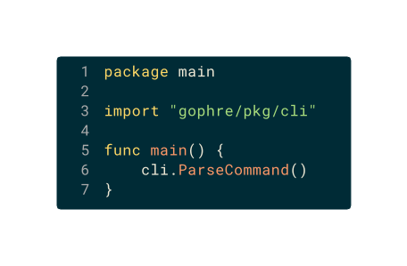

# Gophre - Go Programming News Aggregator

<div align="center">
  
  <br>
  <em>A lightweight, fast Go programming news feed aggregator</em>
</div>

## About Gophre

Gophre is a modern RSS feed aggregator specifically focused on Go programming language content. It automatically collects and displays the latest news, blog posts, and updates from the Go ecosystem, allowing users to:

- View a curated feed of latest Go-related content
- Categorize content with upvotes/downvotes
- Bookmark favorite articles
- Filter content by source or keyword
- Access content on any device via responsive design

## Features

- **Live Feed**: Real-time updates of Go programming news and articles
- **Content Curation**: Vote on articles to personalize your feed
- **User Authentication**: GitHub-based login
- **Bookmarks**: Save articles for later reading
- **Search**: Find specific content across all feeds
- **Source Filtering**: View content from specific sources
- **Responsive Design**: Mobile and desktop friendly
- **Rate-limiting**: Protection against excessive requests

## Screenshots

<div align="center">
  
</div>

## Installation

### Prerequisites

- Go 1.16 or higher
- GitHub OAuth credentials (for authentication features)

### Setup

1. Clone the repository:
```bash
git clone https://github.com/your-username/gophre.git
cd gophre
```

2. Copy `.env.example` to create your environment file:
```bash
cp .env.example .env
```

3. Edit `.env` with your GitHub OAuth credentials:
```
GITHUB_CLIENT_ID=your-client-id
GITHUB_CLIENT_SECRET=your-client-secret
GITHUB_CALLBACK_URL=http://localhost:4447/auth/github/callback
```

4. Build the application:
```bash
go build -ldflags "-s -w" -o bin/gophre cmd/main.go
```

5. Initialize data (optional):
```bash
./bin/gophre reset
```

6. Update RSS feeds:
```bash
./bin/gophre update
```

## Usage

### Starting the Web Server

```bash
./bin/gophre serve [port]
```
If no port is specified, the server will use port 4447 by default.

### Commands

- **Update RSS feeds**: `./bin/gophre update`
- **Run local web server**: `./bin/gophre serve [port]`
- **Reset all data**: `./bin/gophre reset`

### Endpoints

- **`/`**: Main feed with the most recent articles
- **`/all`**: Unfiltered feed with all articles
- **`/me`**: Your bookmarked articles (requires login)
- **`/top`**: Most upvoted articles
- **`/{source}`**: Articles from a specific source

## Configuration

### RSS Feeds

RSS feeds are configured in the `rss/rss_feeds.json` file. Each feed has:
- Name
- URL
- Path (category)

### User Data

- Votes are stored in `rss/votes.json`
- User preferences are stored in the `users/` directory

## Development

### Project Structure

```
gophre/
├── assets/          # Static assets (CSS, JS, images)
├── bin/             # Compiled binary
├── cmd/             # Application entry point
│   └── data/        # Data structures
├── env/             # Environment configuration
├── pkg/             # Application packages
│   ├── cli/         # Command-line interface
│   ├── rss/         # RSS feed processing
│   ├── service/     # Core services
│   └── web/         # Web server and handlers
├── rss/             # RSS data files
└── users/           # User data files
```

### Build Commands

- Build app: `go build -ldflags "-s -w" -o bin/gophre cmd/main.go`
- Run web server: `./bin/gophre serve [port]`
- Update RSS feeds: `./bin/gophre update`
- Reset data: `./bin/gophre reset`
- Tidy dependencies: `go mod tidy`

## Contributing

Contributions are welcome! Please feel free to submit a Pull Request.

1. Fork the repository
2. Create your feature branch (`git checkout -b feature/amazing-feature`)
3. Commit your changes (`git commit -m 'Add some amazing feature'`)
4. Push to the branch (`git push origin feature/amazing-feature`)
5. Open a Pull Request

## License

This project is licensed under the MIT License - see the [LICENSE.txt](LICENSE.txt) file for details.

## Acknowledgements

- [Go Programming Language](https://golang.org/)
- [Gin Web Framework](https://github.com/gin-gonic/gin)
- [Goth OAuth Library](https://github.com/markbates/goth)
- All the amazing Go content creators and bloggers